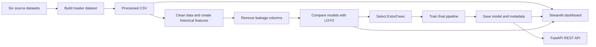

# Cereal Yield Forecasting in Tunisia

# 1. A simple 90-second opening answer

**Question: Can you introduce your project?**

**Answer:**

My project is called the Tunisia Cereal Yield Forecasting Framework, or TCYFF.

The problem is that cereal yield changes between governorates and harvest years because of rainfall, temperature, vegetation, soil conditions, regional differences, and previous agricultural performance. A national average can also hide important regional differences.

The solution is an end-to-end machine-learning decision-support system. It combines six agricultural and environmental data sources into one governorate-year dataset. It prepares historical features, removes current-year outcome columns that could cause data leakage, and compares several regression models using Leave-One-Year-Out validation.

The selected deployed model is an ExtraTrees Regressor. It achieved an RMSE of 4.097 qx/ha, an MAE of 2.925 qx/ha, and an R² of 0.758.

The final model is saved as a reusable pipeline and is connected to a Streamlit dashboard and a FastAPI REST API. The dashboard also includes national aggregation, error analysis, feature importance, and an experimental drought-risk prototype.

---
# 2. Main beneficiaries

1. Agricultural analysts — they can study yield patterns and compare regions.
2. Government planners and decision-makers — they can identify governorates or years that may need more attention.
3. Researchers and universities — they can use the project for agricultural and machine-learning studies.
4. Data scientists and developers — they can reuse the model, dashboard, and API.
5. Agricultural organisations — they can use the results to support monitoring and planning.
6. Farmers indirectly — they may benefit from better decisions, but the model does not predict at individual farm level. 

# 3. Project architecture



## Simple explanation

1. The source files are cleaned and combined.
2. One processed dataset is created.
3. Historical features are added.
4. Columns that could reveal the target are removed.
5. Several models are tested using Leave-One-Year-Out validation.
6. ExtraTrees is selected.
7. The final pipeline is trained on all supervised rows.
8. The model and metadata are saved.
9. The dashboard and API load the same saved model.

---

# 4. Main machine-learning pipeline

```text
CSV
→ load_raw_data()
→ add_safe_historical_features()
→ remove leakage columns
→ create X and y
→ identify numeric and categorical columns
→ numeric median imputation
→ categorical most-frequent imputation
→ one-hot encoding
→ ExtraTrees Regressor
→ save complete pipeline with Joblib
→ load pipeline in dashboard and API
```

---

# 5. Technology stack

| Technology | Use in the project |
|---|---|
| Python | Main programming language |
| pandas | Reading, cleaning, grouping, and analysing tables |
| NumPy | Numeric calculations and arrays |
| scikit-learn | Preprocessing, pipelines, models, and metrics |
| ExtraTrees | Selected deployed regression model |
| XGBoost and LightGBM | Candidate models in the comparison workflow |
| Joblib | Saving and loading the trained pipeline |
| Jupyter / Google Colab | Dataset construction, model comparison, and report figures |
| Matplotlib | Report figures |
| Plotly | Interactive dashboard charts |
| Streamlit | Interactive dashboard framework |
| FastAPI | REST API framework |
| Uvicorn | Runs the FastAPI application |
| Pydantic | Checks the structure of API requests |
| JSON | Stores model metadata and API responses |
| Git and GitHub | Version control and repository hosting |

---

# 6. Suggested 20–30 minute structure

| Time | What to explain |
|---|---|
| 2 minutes | Problem, objective, and target |
| 3 minutes | Solution and architecture |
| 4 minutes | Dataset and feature preparation |
| 4 minutes | CRISP-DM, leakage, and validation |
| 4 minutes | Models, metrics, and ExtraTrees selection |
| 5 minutes | Dashboard demonstration |
| 3 minutes | API and repository structure |
| Remaining time | Questions and answers |

---

# Part A — 37 main technical questions

## 1. What problem does the project solve?

The project addresses the difficulty of forecasting cereal yield across Tunisian governorates.

Yield changes because of rainfall, heat, vegetation, soil conditions, regional differences, and previous agricultural performance. The available dataset is also relatively small and covers different years and regions.

The system estimates yield at governorate level instead of using only a national value, because national values can hide regional differences.

---

## 2. What is the proposed solution?

The solution is an end-to-end decision-support framework.

It:

- combines agricultural and environmental data,
- creates one structured governorate-year dataset,
- prepares safe historical features,
- removes current-year outcome columns,
- compares several regression models,
- validates them by harvest year,
- saves the selected model,
- presents results in a dashboard,
- exposes predictions through an API.

---

## 3. What exactly does the model predict?

The model predicts:

```text
Target_Total_Yield_QxHa
```

This is the aggregate yield of:

- durum wheat,
- soft wheat,
- barley.

The unit is **quintals per hectare**, written as `qx/ha`.

One quintal is 100 kilograms. Yield tells us how much cereal is produced from one hectare of land.

For example:

> A yield of 20 qx/ha means approximately 2,000 kilograms of cereal per hectare.

This is different from total production, because total production also depends on how many hectares were cultivated.

---

## 4. What does one observation represent?

One observation represents:

```text
one governorate + one harvest year
```

For example, Beja in 2015 is one observation.

---

## 5. What is the dataset size?

The processed CSV contains:

- 342 candidate rows,
- 131 columns.

After removing rows without a valid target, the modelling data contains:

- 338 supervised observations,
- 18 governorates,
- years from 2002 to 2020,
- 123 approved input features.

---

## 6. Which data sources were used?

Six main sources were combined:

- ONAGRI for agricultural statistics,
- CHIRPS for rainfall,
- ERA5 for climate and temperature,
- MODIS for vegetation,
- SoilGrids for soil information,
- OpenLandMap for additional soil information.

---

## 7. Why use several data sources?

Cereal yield is not controlled by one factor.

Rainfall, temperature, vegetation condition, soil properties, location, and previous agricultural performance can all affect the result.

Combining several sources gives the model a wider view of the conditions in each governorate and year.

---

## 8. What is the system architecture?

The architecture has four main layers:

1. **Data layer:** source data and the processed CSV.
2. **Machine-learning layer:** cleaning, historical features, leakage filtering, model comparison, and final training.
3. **Persistence layer:** the saved Joblib pipeline, JSON metadata, and result CSV files.
4. **Application layer:** the Streamlit dashboard and FastAPI REST API.

The dashboard uses the dataset, saved results, and saved model. The API mainly uses the saved model and metadata.

---

## 9. What are the main steps of the pipeline?

The main steps are:

1. load the processed CSV,
2. clean column names and important values,
3. remove rows without the target, year, or governorate,
4. sort by governorate and year,
5. create historical features,
6. remove leakage and metadata columns,
7. separate inputs `X` from target `y`,
8. identify numeric and categorical columns,
9. fill missing values,
10. one-hot encode categories,
11. train the ExtraTrees model,
12. save the full pipeline and metadata.

---

## 10. What methodology was used?

The machine-learning project follows **CRISP-DM**.

CRISP-DM means Cross Industry Standard Process for Data Mining.

Its phases are:

1. business understanding,
2. data understanding,
3. data preparation,
4. modelling,
5. evaluation,
6. deployment.

Kanban was used separately to organise the implementation tasks and monitor progress.

---

## 11. How was CRISP-DM applied?

### Business understanding

The agricultural problem was translated into a regression task: predict governorate-level cereal yield in qx/ha.

### Data understanding

The project checked the years, governorates, target distribution, missing values, and feature groups.

### Data preparation

The datasets were cleaned and combined. Historical features were created and leakage-related columns were removed.

### Modelling

Several regression models and simple baselines were tested.

### Evaluation

Leave-One-Year-Out validation and regression metrics were used.

### Deployment

The selected model was saved and connected to Streamlit and FastAPI.

---

## 12. Why was Kanban used?

CRISP-DM explains the data-science lifecycle.

Kanban helps manage the actual work.

It was used to divide the project into smaller tasks such as:

- data cleaning,
- feature engineering,
- model testing,
- dashboard development,
- API development,
- documentation,
- testing and corrections.

---

## 13. What is data leakage?

Data leakage happens when the model receives information that already reveals the answer.

For example, using current-year cereal production or current-year crop yield to predict the same year's total yield would make the test result unrealistic.

The model might look accurate because it has been given part of the answer.

---

## 14. How did you reduce leakage?

The code removes:

- the target,
- current-year crop yield,
- current-year production,
- current-year cultivated area,
- current outcome shares,
- target-related proxy variables,
- some metadata columns.

It then creates historical features using earlier observations.

The exact removed columns are saved in:

```text
results/01_dropped_leakage_columns.csv
```

---

## 15. What are historical features?

Historical features describe what happened earlier in the same governorate.

Examples are:

- previous yield,
- yield from two years earlier,
- previous production,
- previous cultivated area,
- rolling three-year mean,
- rolling five-year mean,
- expanding historical mean.

These features help the model learn regional patterns over time.

---
---

## 16. Why use `shift(1)` for historical features?

`shift(1)` moves a value down by one observation inside each governorate.

This means the current row receives information from the previous observation instead of using its own current target.

For example, the record for Beja in 2015 can use an earlier Beja yield, but it should not use the 2015 target that the model is trying to predict.

This helps reduce direct target leakage.

---

## 17. How are missing values handled?

For numeric columns, missing values are replaced with the median.

The median is used because it is not strongly pulled by unusually large or small values.

For categorical columns, missing values are replaced with the most frequent category.

The categories are then converted into numbers using one-hot encoding.

---

## 18. Why use one-hot encoding?

Models need numeric input.

One-hot encoding turns a category into separate 0/1 columns.

For example:

```text
Governorate = Beja
```

can become:

```text
Governorate_Beja = 1
Governorate_Kef = 0
```

This lets the model use text categories without treating them as an ordered number.

---

## 19. What validation method was used?

The project uses Leave-One-Year-Out validation, or LOYO.

In each round:

- one complete harvest year is held out,
- the other years are used for training,
- the model predicts the held-out year.

The process repeats until every year has been tested once.

---

## 20. Why not use a random split?

A random split can place records from the same harvest year in both training and testing.

Those records may share similar rainfall and national climate conditions.

This can make performance look more optimistic.

LOYO tests whether the model can generalise to a complete unseen year.

---

## 21. Which models were tested?

The report describes:

- Ridge Regression,
- Random Forest,
- Gradient Boosting,
- XGBoost Regularized,
- LightGBM Regularized,
- ExtraTrees,
- historical formulas,
- simple baselines,
- weighted blends.

---

## 22. Which evaluation metrics were used?

The main metrics are:

- RMSE,
- MAE,
- R².

The report also discusses MAPE, but the final comparison table mainly uses RMSE, MAE, and R².

---

## 23. What do RMSE, MAE, and R² mean?

### MAE

MAE tells us the model’s **average mistake**.

For example, an MAE of **2.925 qx/ha** means:

> On average, the prediction is about 2.9 qx/ha away from the real yield.

Lower is better.

---

### RMSE

RMSE also measures prediction error, but it gives **more attention to very large mistakes**.

For example, an RMSE of **4.097 qx/ha** means that some larger errors increased the overall score.

Lower is better.

**Simple difference:**

* MAE shows the normal average error.
* RMSE is more affected by large errors.

---

### R²

R² shows how well the model understands the differences between low-yield and high-yield observations.

An R² of **0.758** means:

> The model explains about 75.8% of the changes and differences seen in cereal yield.

Higher is better.

It does **not** mean that every prediction is 75.8% correct.


---

## 24. What are the final ExtraTrees results?

The selected ExtraTrees model achieved:

| Metric | Result |
|---|---:|
| RMSE | 4.0971 qx/ha |
| MAE | 2.9248 qx/ha |
| R² | 0.7584 |

---

## 25. What is ExtraTrees?

ExtraTrees is an ensemble regression model.

An ensemble combines many decision trees instead of trusting one tree.

ExtraTrees also adds randomness when choosing features and split points. The final prediction is the average result from the trees.

This helps it model nonlinear relationships and interactions.

---

## 26. What are the main ExtraTrees settings?

```python
ExtraTreesRegressor(
    n_estimators=800,
    random_state=42,
    min_samples_leaf=2,
    max_features="sqrt",
    n_jobs=-1,
)
```

Simple meaning:

- 800 trees are built,
- each final leaf has at least two rows,
- each split checks only a subset of features,
- the fixed seed supports repeatability,
- all CPU cores are used.

---

## 27. Why was standard ExtraTrees selected if another result was slightly better?

The deeper ExtraTrees variant had a slightly lower RMSE, and one blend had a slightly lower MAE.

The standard ExtraTrees model was still selected because:

- its results were close to the best ones,
- it required only one model,
- it was easier to save and load,
- it was easier to maintain,
- it provided feature importance,
- it integrated cleanly with the dashboard and API.

The choice considered both performance and deployment simplicity.

---

## 28. What is the difference between evaluation and final training?

Evaluation uses LOYO to estimate performance on unseen years.

After the model type is selected, `train_final_model.py` fits the final pipeline on all 338 supervised observations.

The saved final model is used for deployment.

The evaluation metrics come from the validation process, not from fitting on all rows and testing on the same rows.

---

## 29. How did you check generalisation, overfitting, and underfitting?

Overfitting means the model learns the training data too closely and performs poorly on new data.

Underfitting means the model is too simple and performs poorly on both training and validation data.

I checked generalisation using:

- Leave-One-Year-Out validation,
- comparison against simple baselines,
- actual-versus-predicted plots,
- residual analysis,
- error by year,
- error by governorate.

Traditional training-versus-validation loss curves are not available because ExtraTrees does not train through epochs like a neural network.

It builds its trees and finishes training. Therefore, I use LOYO metrics and residual analysis instead of epoch loss curves.

---

## 30. How did you explain the model?

I used:

- ExtraTrees built-in feature importance,
- actual-versus-predicted plots,
- residual analysis,
- year-level error analysis,
- governorate-level error analysis.

Feature importance shows which transformed inputs were useful to the model overall.

It does not prove that a feature causes yield to change, and it does not fully explain one individual prediction.

I did not include SHAP or LIME in the final repository. Adding SHAP for individual predictions would be a useful future improvement.

---

## 31. How did you analyse model errors?

Because this is regression, a confusion matrix is not appropriate.

A confusion matrix is used for classification, while this model predicts a continuous yield value.

I used residual analysis instead. A residual is the difference between the actual and predicted value.

The project analyses:

- residual distribution,
- actual-versus-predicted values,
- MAE by year,
- MAE by governorate,
- bias, meaning whether the model tends to predict too high or too low.

In the saved analysis:

- 2002 had the highest year-level MAE, about 4.55 qx/ha,
- Sidi Bouzid had the highest governorate-level MAE, about 6.80 qx/ha.

The model may struggle more with unusual years, extreme yields, or difficult regional patterns because the dataset is small.

---

## 32. What does the dashboard show?

The dashboard has these sections:

- Overview,
- National View,
- Drought Risk Prototype,
- Model Performance,
- Feature Importance,
- Regional Insights,
- Single Prediction,
- API / Deployment Notes.

It combines model results, charts, error analysis, predictions, and deployment information.

---

## 33. What is the REST API used for?

The API allows another application to request a prediction through HTTP.

It accepts JSON input, places the values in the correct feature order, passes them through the saved preprocessing and ExtraTrees pipeline, and returns a JSON prediction.

FastAPI also creates automatic documentation at:

```text
http://127.0.0.1:8000/docs
```

## 34. How was the project tested?

The repository includes automated tests using `pytest`.

The test files are:

```text
tests/test_utils.py
tests/test_api.py
```

The testing dependencies are stored in:

```text
requirements-dev.txt
```

The complete suite contains **10 passing tests**.

### Unit tests

The utility tests act as unit tests because they check individual preparation functions separately.

They cover:

- processed-data loading,
- governorate-year sorting,
- historical feature creation,
- leakage-column removal,
- the final 123-feature schema.

### Integration tests

The API tests act as integration tests because they check several components working together:

- FastAPI,
- the saved ExtraTrees pipeline,
- model metadata,
- preprocessing,
- prediction,
- JSON responses.

They test:

- `/health`,
- `/model-info`,
- `/features`,
- successful `/predict` requests,
- empty or unknown API inputs.

The Streamlit dashboard was tested manually by checking page loading, charts, tables, filters, and the single-prediction workflow.

A production system would add more unit tests, automatic interface tests, continuous integration, and monitoring.

---

## 35. How are code, model, and project versions managed?

Code versioning is handled using Git and GitHub.

The repository also stores:

- the processed dataset,
- the saved model,
- the metadata JSON,
- the saved evaluation outputs,
- the main package requirements,
- the testing requirements.

The metadata records information such as:

- target and unit,
- feature order,
- numeric and categorical columns,
- removed columns,
- training-row count,
- dataset information,
- software-version information.

This provides basic reproducibility and version tracking.

For a larger production project, I would use a tool such as MLflow or DVC for stronger experiment, dataset, and model tracking.

---

## 36. What was the biggest technical challenge?

The biggest technical challenge was combining several different data sources while avoiding target leakage.

The sources had different formats, column names, time coverage, missing values, and measurement types.

Agricultural production, cultivated area, and yield are also mathematically related. If current-year production or area is included, the model may indirectly receive part of the answer.

I addressed this by:

- standardising governorate names,
- checking required columns,
- checking unique merge keys,
- building one canonical dataset,
- removing current-year outcome columns,
- creating historical features,
- evaluating with LOYO.

---

## 37. What would you improve next?

My first improvement would be to create historical features separately inside every LOYO validation fold.

The current workflow removes direct current-year outcome columns and uses earlier observations for historical features. Creating those features separately inside each validation round would make the evaluation stricter and more reliable.

I would also:

- add newer data,
- build separate models for each cereal crop,
- show prediction ranges,
- add SHAP explanations,
- improve API input validation,
- add more automated tests and monitoring,
- use MLflow or DVC,
- deploy the system securely to the cloud.

---

# Part B — 20 backup code and implementation questions

## 38. What does `load_raw_data()` do?

It:

1. reads the CSV with pandas,
2. removes spaces from column names,
3. converts the year and target to numeric values,
4. removes rows missing the target, year, or governorate,
5. converts the year to an integer,
6. sorts the data by governorate and year.

Sorting is necessary before historical features are created.

---

## 39. Why use `pd.to_numeric(..., errors="coerce")`?

It safely converts values to numbers.

When a value cannot be converted, it becomes `NaN` instead of stopping the program with an error.

The code can then remove or handle that missing value in a controlled way.

---

## 40. Why sort by governorate and year?

Lag and rolling features depend on order.

The code must know which record came earlier for each governorate.

Without sorting, the “previous year” value could be taken from the wrong row.

---

## 41. Why use `df.copy()`?

`df.copy()` creates a separate DataFrame.

This prevents a function from unexpectedly changing the original table that was passed into it.

It makes the code safer and easier to understand.

---

## 42. What does `add_safe_historical_features()` do?

It groups records by governorate and creates historical variables such as:

- lag-one yield,
- lag-two yield,
- rolling yield means,
- expanding yield mean,
- previous production,
- previous cultivated area,
- historical production-to-area formulas.

The word `SAFE` means the feature is intended to use earlier observations rather than the current target.

---

## 43. Why use `groupby(Governorate)`?

Historical patterns must be calculated separately for each governorate.

Without grouping, the previous row for Beja could incorrectly come from Kef or another governorate.

---

## 44. Why use `min_periods=1` in a rolling mean?

The earliest records may not have three or five earlier years available.

`min_periods=1` allows the rolling mean to be calculated using the earlier values that do exist.

Without it, many early rows would remain missing.

---

## 45. Why does the code check whether a column exists?

Some versions of the dataset may not contain every optional production or area column.

The condition:

```python
if "column_name" in df.columns:
```

prevents the program from crashing and makes the function more flexible.

---

## 46. What does `prepare_training_data()` do?

It connects the preparation steps.

It:

1. loads the CSV,
2. adds historical features,
3. finds the leakage columns that exist,
4. removes them from the feature list,
5. creates `X`,
6. creates `y`,
7. returns the prepared DataFrame, feature names, and removed columns.

---

## 47. What are `X` and `y`?

`X` is the table of input features.

Examples include rainfall, vegetation, soil, governorate, and historical values.

`y` is the correct target the model learns to predict:

```text
Target_Total_Yield_QxHa
```

---

## 48. Why use `ColumnTransformer`?

Numeric and categorical columns need different preparation.

`ColumnTransformer` applies:

- median imputation to numeric columns,
- most-frequent imputation and one-hot encoding to categorical columns.

It then combines the prepared columns into one model input table.

---

## 49. Why use a scikit-learn `Pipeline`?

The pipeline keeps preprocessing and the model together.

This ensures that the same missing-value handling and encoding are used during:

- training,
- dashboard predictions,
- API predictions.

It reduces the risk of inconsistent preparation.

---

## 50. Why use `handle_unknown="ignore"`?

A new prediction could contain a category that was not present during training.

Without this setting, one-hot encoding could fail.

With `ignore`, the unknown category does not crash the pipeline. However, a prediction for an unseen governorate should still be treated carefully.

---

## 51. Why use `remainder="drop"`?

It tells `ColumnTransformer` to exclude any column that was not explicitly assigned to the numeric or categorical preparation groups.

This keeps the final model input controlled.

---

## 52. What does `train_final_model.py` do?

It:

1. calls `prepare_training_data()`,
2. identifies numeric and categorical columns,
3. builds the preprocessing and ExtraTrees pipeline,
4. trains it on all supervised observations,
5. saves the pipeline as a Joblib file,
6. saves metadata as JSON.

---

## 53. Why save the model with Joblib?

Joblib can save and reload trained Python machine-learning objects efficiently.

In this project, it saves the complete pipeline, not only the ExtraTrees object.

That means the imputation and encoding steps are saved with the model.

---

## 54. Why save `model_metadata.json`?

The JSON file provides readable information about the model.

It includes:

- target name and unit,
- feature order,
- numeric and categorical columns,
- removed columns,
- training-row count,
- model name and version information.

The API uses the feature order to rebuild prediction requests correctly.

---

## 55. What do the dashboard loading functions do?

### `load_model()`

Loads the Joblib model and JSON metadata.

It uses `@st.cache_resource` because the model is a large reusable object.

### `load_data()`

Loads the CSV and adds historical features.

It uses `@st.cache_data` because it returns DataFrames.

### `load_csv_if_exists()`

Loads a result CSV only when it exists. Otherwise, it returns `None` so the dashboard can show a readable warning.

---

## 56. What do `build_national_view()` and `build_drought_risk()` do?

### `build_national_view()`

It combines governorate predictions into one annual national estimate.

It prefers an area-weighted average. If valid area values are unavailable, it uses a simple average.

### `build_drought_risk()`

It creates an experimental score from rainfall, vegetation, soil-water, and heat indicators.

It is transparent and rule-based. It is not the ExtraTrees model and is not an official drought-warning system.

---

## 57. What does the API `predict()` function do?

It:

1. checks that the request is not empty,
2. checks that at least one feature name is recognised,
3. rebuilds the row in the exact training feature order,
4. fills missing expected values with `NaN`,
5. converts the row into a pandas DataFrame,
6. calls `model.predict()`,
7. returns the prediction and information about missing or extra features.

A set called `FEATURE_SET` is used because checking membership in a set is fast.

---

# Part C — Repository organisation

**Question: How is the GitHub repository organised?**

**Answer:**

```text
CerealsYield-TeamB/
├── app/
├── data/
├── docs/
├── models/
├── notebooks/
├── results/
├── tests/
├── train_final_model.py
├── requirements.txt
├── requirements-dev.txt
├── setup_and_train_windows.bat
├── run_dashboard_windows.bat
├── run_api_windows.bat
└── README.md
```

### `app/`

Contains shared preparation functions, the Streamlit dashboard, and the FastAPI REST API.

### `data/`

Contains the canonical processed governorate-year dataset.

### `docs/`

Contains the final written academic report.

### `models/`

Contains the saved ExtraTrees pipeline and readable model metadata.

### `notebooks/`

Contains dataset construction, model comparison, and report-figure notebooks.

### `results/`

Contains leakage lists, feature lists, model metrics, feature importance, error analysis, national aggregation, and drought-risk outputs.

### `tests/`

Contains automated unit-style preparation tests and API integration tests.

### Important root files

- `train_final_model.py` trains and saves the final model.
- `requirements.txt` lists the main project packages.
- `requirements-dev.txt` lists the testing packages.
- The `.bat` files simplify setup, dashboard startup, and API startup on Windows.

---

# Part D — Dashboard demonstration

## Transition to the dashboard

> Now I will demonstrate how the technical work is presented to users through the Streamlit dashboard.

Before showing the first page, explain:

> The dashboard is the application layer of the project. It loads the processed dataset, saved evaluation results, model metadata, and the trained ExtraTrees pipeline. The model is not retrained every time the dashboard opens.

## Start the dashboard

```powershell
python -m streamlit run app/dashboard.py
```

When explaining a chart, follow this order:

1. State the purpose of the page.
2. Name the type of chart.
3. Explain the horizontal and vertical axes.
4. Explain what high, low, long, short, close, or distant values mean.
5. Give the correct interpretation or limitation.

---

## Dashboard page 1 — Overview

### Start with this

> This is the Overview page. It gives a quick summary of the dataset, model inputs, selected model, and official validation results.

### Dataset cards

- **342 candidate rows:** Each candidate row represents one governorate in one harvest year.
- **338 supervised observations:** Four candidate rows do not have a usable target, so 338 rows are used for modelling.
- **18 governorates:** The system learns national and regional patterns.
- **2002–2020:** The data has a time structure, which supports year-based validation.
- **123 predictors:** These are the approved inputs after leakage and metadata filtering.

### Metric cards

- **RMSE = 4.097 qx/ha:** Measures error and gives more importance to large mistakes. Lower is better.
- **MAE = 2.925 qx/ha:** The prediction is about 2.9 qx/ha away from the real yield on average. Lower is better.
- **R² = 0.758:** The model represents about 75.8% of the observed yield variation. It does not mean every prediction is 75.8% correct.

### Unit reminder

> The unit is qx/ha. One quintal equals 100 kilograms, so 20 qx/ha means about 2,000 kilograms per hectare.

### Dataset preview table

> This table shows the structure of the processed data. Each row includes a governorate, harvest year, target, and agricultural or environmental variables.

### Important clarification

> The displayed performance metrics come from Leave-One-Year-Out validation, not from testing the final model on the same rows used for training.

---

## Dashboard page 2 — National View

### Start with this

> The model predicts at governorate level. This page combines those governorate predictions into a national yearly view.

### Area weighting

> When cereal-area information is available, governorates with larger cereal areas have more influence on the national value. This is more meaningful than treating a small and a large cereal-producing governorate equally.

### Main cards

- **Years covered:** Number of years included in the national summary.
- **Mean national absolute error:** Average distance between actual and predicted national yield.
- **Mean national percentage error:** Error expressed as a percentage of actual national yield.
- **Latest predicted yield:** National estimate for the latest available year.

### Actual-versus-predicted line chart

> This line chart compares actual and predicted national cereal yield over time.

- **Horizontal axis:** Harvest year.
- **Vertical axis:** Yield in qx/ha.
- One line shows actual national yield.
- The other shows predicted national yield.
- When the lines are close, the prediction follows the observed value well.
- A large gap means a larger prediction error.
- Peaks show higher-yield years and dips show lower-yield years.

### National table

> The table gives the exact values behind the chart, including actual yield, predicted yield, error, cereal area, and number of governorates.

### Important clarification

> This is not a separate national machine-learning model. It is an area-weighted aggregation of governorate-level predictions.

---

## Dashboard page 3 — Drought Risk Prototype

### Start with this

> This page presents an experimental drought-risk interpretation. It is separate from the ExtraTrees yield model.

### Risk score

- The score ranges from 0 to 100.
- A higher score means more drought-related stress signals.
- It combines rainfall deficit, vegetation stress, soil-water stress, and heat stress.
- Results are grouped into Low, Moderate, and High risk.

### Year selector

> The user selects a harvest year to compare the governorates during the same period.

### Summary cards

- Number of high-risk governorates.
- Number of moderate-risk governorates.
- Average risk score.
- Governorate with the highest score.

### Risk-distribution bar chart

> This bar chart shows how many governorates fall into each risk category.

- **Horizontal axis:** Low, Moderate, and High.
- **Vertical axis:** Number of governorates.
- A taller bar means more governorates are in that category.

### Highest-risk governorates chart

> This horizontal bar chart ranks governorates by risk score.

- **Vertical axis:** Governorate names.
- **Horizontal axis:** Risk score from 0 to 100.
- A longer bar means a higher risk score.

### Stress-component trend chart

> This line chart shows how the individual stress components change over time for a selected governorate.

- **Horizontal axis:** Harvest year.
- **Vertical axis:** Component score.
- Separate lines represent rainfall, vegetation, soil-water, heat, and the total risk score.
- A high component line means that factor contributed more strongly in that year.

### Detailed table

> The table provides the score, category, main stress driver, component values, climate indicators, actual yield, and predicted yield for each governorate.

### Important clarification

> This is a transparent rule-based academic prototype. It is not an official drought-warning system and is not used to calculate the ExtraTrees RMSE, MAE, or R².

---

## Dashboard page 4 — Model Performance

### Start with this

> This page compares candidate models, simple baselines, historical formulas, and experimental blends.

### Comparison table

> The table shows the model name, RMSE, MAE, R², and its role in the project.

- Lower RMSE is better.
- Lower MAE is better.
- Higher R² is better.
- The role indicates whether the approach is a baseline, candidate, experiment, or selected model.

### RMSE bar chart

> This horizontal bar chart compares approaches by RMSE.

- **Vertical axis:** Model or approach name.
- **Horizontal axis:** RMSE in qx/ha.
- A shorter bar is better because it represents a smaller error.

### Selection explanation

> A deeper ExtraTrees version had a slightly lower RMSE, and one blend had a slightly lower MAE. Standard ExtraTrees was selected because its results were close to the best while it remained easier to save, explain, maintain, and integrate.

### Key sentence

> The final choice considered both predictive performance and deployment simplicity.

---

## Dashboard page 5 — Feature Importance

### Start with this

> This page shows which transformed input features were most useful to the ExtraTrees model overall.

### Feature-count control

> The user can choose how many top features to display.

### Horizontal importance chart

- **Vertical axis:** Feature names.
- **Horizontal axis:** Importance value.
- A longer bar means the model used that feature more strongly when making tree decisions.

### Why there may be more transformed features

> The model begins with 123 original inputs. One-hot encoding expands categorical inputs into several 0/1 columns, so the internal transformed feature list can be longer.

### Important limitations

- Importance is global, not an explanation of one prediction.
- Importance does not prove causation.
- It does not show whether the feature increases or decreases yield.
- SHAP would be a future improvement for individual prediction explanations.

### Table

> The table gives the exact importance values shown in the chart.

---

## Dashboard page 6 — Regional Insights

### Start with this

> Overall metrics can hide where the model performs well or poorly. This page breaks errors down by year and governorate.

### Year-level table and chart

> These results compare errors across harvest years and help identify difficult or unusual years.

- The year-level MAE chart has harvest years on one axis and MAE in qx/ha on the other.
- A larger value means the model made larger average errors in that year.
- In the saved results, 2002 had the highest year-level MAE, about 4.55 qx/ha.

### Governorate-level table and chart

> These results compare average errors across regions.

- The horizontal bar chart lists governorates and their MAE.
- A longer bar means larger average errors.
- A shorter bar means predictions are usually closer to actual yield.
- In the saved results, Sidi Bouzid had the highest governorate-level MAE, about 6.80 qx/ha.

### Bias

- Positive bias means the model tends to predict too high.
- Negative bias means it tends to predict too low.

### Important clarification

> Because this is regression, a confusion matrix is not suitable. These error tables and charts provide the detailed regression analysis instead.

---

## Dashboard page 7 — Single Prediction

### Start with this

> This page demonstrates how the saved model pipeline produces one prediction from an existing historical record.

### Selection controls

- Select a governorate.
- Select one available historical year for that governorate.

### Result cards

- **Predicted yield:** Output from the saved ExtraTrees pipeline.
- **Actual yield:** Real recorded target for that row.
- **Absolute error:** Distance between prediction and actual value, without considering direction.

### Input table

> This table shows the feature values sent to the model.

### Prediction flow

```text
Selected record
→ correct feature order
→ missing-value imputation
→ one-hot encoding
→ ExtraTrees prediction
→ yield in qx/ha
```

### Important clarification

> This page demonstrates deployment and pipeline integration. It is not the official validation experiment because the final saved model was trained on all supervised observations. The official metrics come from LOYO.

---

## Dashboard page 8 — API / Deployment Notes

### Start with this

> The dashboard is designed for human users. The REST API allows another software application to use the same trained model.

### REST API explanation

> Another program sends feature values in JSON format. The API arranges them in the expected order, sends them through the saved preprocessing and ExtraTrees pipeline, and returns a prediction as JSON.

### Start command

```powershell
python -m uvicorn app.rest_api:app --reload
```

### Interactive documentation

```text
http://127.0.0.1:8000/docs
```

### Endpoints

- `/health` — checks whether the service, model, and metadata loaded correctly.
- `/model-info` — returns model, target, unit, and feature information.
- `/features` — lists the expected model inputs.
- `/sample-input` — gives an example JSON request.
- `/predict` — receives features and returns predicted yield.

### Integration explanation

> This demonstrates system integration because FastAPI, model metadata, preprocessing, the saved ExtraTrees model, and the JSON response all work together. The dashboard and API use the same saved pipeline, which keeps predictions consistent.

### Deployment status

> The project currently runs locally as an academic prototype. A production version would require authentication, stronger validation, logging, monitoring, cloud hosting, continuous integration, model-drift detection, and security review.

---

## Dashboard closing statement

> The dashboard turns the technical machine-learning work into an understandable decision-support application. It covers project scope, national aggregation, drought-risk interpretation, model comparison, feature importance, regional errors, individual predictions, and API deployment. The official model evaluation remains the Leave-One-Year-Out result.

---

# Part E — Short answers to memorise

## Why ExtraTrees?

It handled nonlinear relationships well, produced strong LOYO results, provided feature importance, and was simple to deploy.

## Why LOYO?

It tests performance on a complete unseen harvest year.

## Why not a random split?

A random split can mix similar yearly conditions between training and testing.

## What is leakage?

Information that reveals the target or would not realistically be available at prediction time.

## What is a pipeline?

A saved sequence that applies preprocessing and then prediction in the same way every time.

## Why median imputation?

The median is less affected by extreme values.

## Why one-hot encoding?

It converts text categories into numeric 0/1 columns.

## Why 123 inputs but 143 importances?

One-hot encoding expands categorical columns.

## Is the drought score part of ExtraTrees?

No. It is a separate experimental rule-based module.

## Is the system fully production-ready?

It is a complete academic prototype. It already includes automated preprocessing and API tests, but a production system would still need broader UI testing, monitoring, security, cloud deployment, and regular retraining.

---


## What is the unit?

`qx/ha` means quintals per hectare. One quintal is 100 kilograms, so it measures how much cereal is produced from one hectare.

## What is unit testing?

It checks one small function or component separately. In this project, utility tests check loading, sorting, historical features, leakage filtering, and the feature schema.

## What is integration testing?

It checks different components working together. In this project, the API tests check FastAPI, metadata, preprocessing, the saved model, prediction, and JSON responses together.

## What would you improve next?

I would add newer data, crop-specific models, prediction ranges, fold-isolated historical features, stronger monitoring, and secure cloud deployment.
